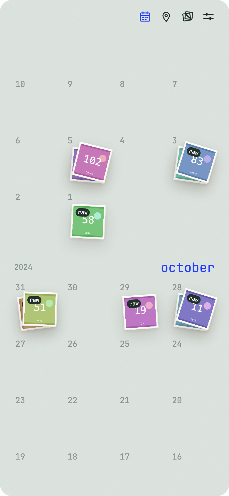

<!-- craft-readme: voice=quiet -->
<div align="center">

# Stacks

**A photo culler that never touches your pixels**

Scans a card or a folder and groups each shoot into stacks by time. Rejects go to the macOS Trash.

[Guide](docs/GUIDE.md) · [What it writes to your files](docs/GUIDE.md#what-it-writes-to-your-files)



</div>

## The deck


A JPG and its RAW twin are one card and one decision. The arrow keys do what the swipe does. [Stacks, places and the deck →](docs/GUIDE.md#stacks-places-and-the-deck)

## Quick start with an agent

> Read CLAUDE.md first. Then run `npm run fixtures` and `npm run app:fixtures`. Tell me how many
> stacks the fixture card produced and where the 2 h 50 m gap landed, and check both against
> `fixtures/MANIFEST.txt`. Run `npm test` and `npm run test:rust` before you touch anything under
> `src/domain/` or `src-tauri/`.

## Quick start

```bash
npm install
npm run fixtures      # a fake SD card, ~110 photos with EXIF and GPS
npm run app:fixtures
```

`npm run app` uses your real volumes and home folders instead. macOS only.

## The shredder


Nothing moves until the last print has gone through. Then the files go to the Trash, and the undo stays for 20 seconds. [What it writes to your files →](docs/GUIDE.md#what-it-writes-to-your-files)

## FAQ

**Does it edit my photos?** Two things, both metadata on a JPEG: EXIF Orientation when you turn a card, and the GPS IFD when you set where a stack was shot. The new bytes are appended, so the pixels are never re-encoded. A camera's own GPS is left alone, and a RAW is never written.

**What about HEIC?** Refused. The iPhone default cannot be rotated or located here, and it says so rather than guessing.

**Where do the city names come from?** A 144k-row GeoNames table vendored into the binary. Place lookup and city search never reach the network.

**Can I get a rejected photo back?** From the reject pile until you shred, and from the undo notice for 20 seconds after that. Later, from the Trash. Stacks moves files rather than deleting them.

## Docs

Everything else is in **[docs/GUIDE.md](docs/GUIDE.md)**: [running it](docs/GUIDE.md#running-it) · [fixtures](docs/GUIDE.md#fixtures) · [limits](docs/GUIDE.md#limits) · [project structure](docs/GUIDE.md#project-structure).

## License

Not licensed yet. City names are from GeoNames, under CC BY 4.0.
